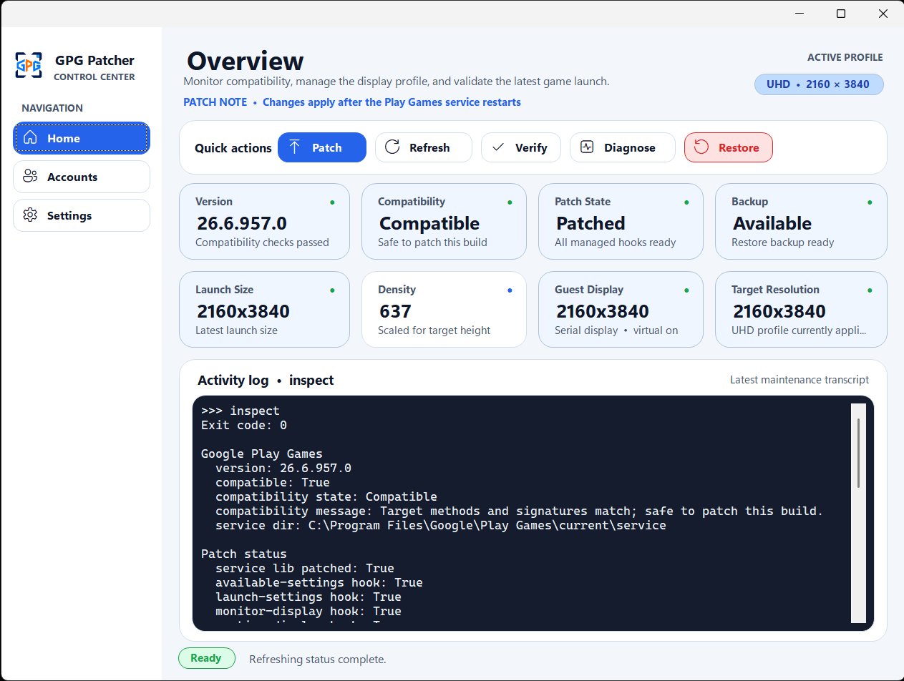
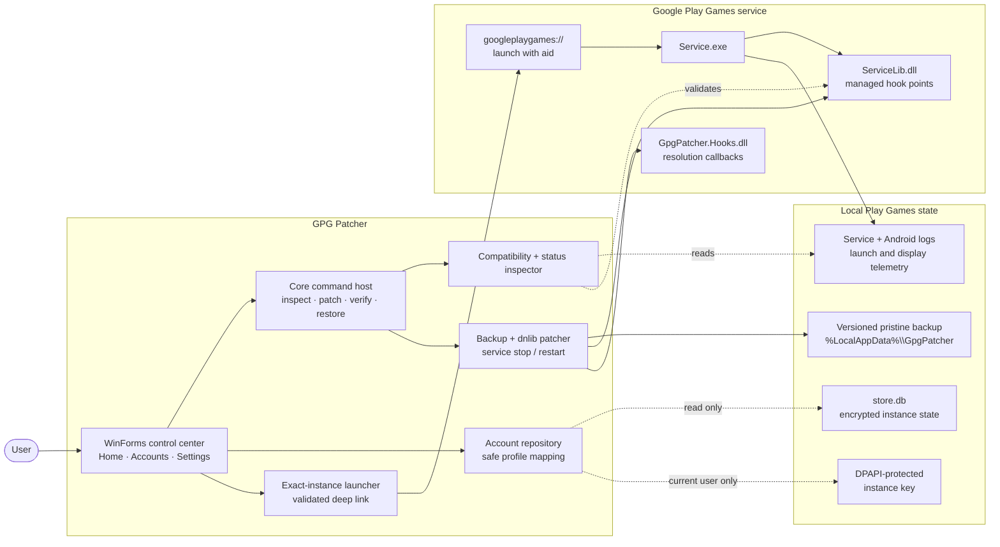
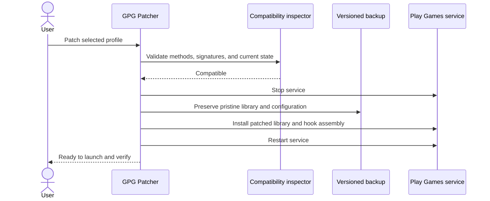

<p align="center">
  
</p>

<h1 align="center">GPG Patcher</h1>

<p align="center">
  <strong>Precision display control and exact account launching for Whiteout Survival<br />on Google Play Games for PC.</strong>
</p>

<p align="center">
  Inspect compatibility, apply a reversible resolution patch, launch the right account,<br />
  and verify the result from one focused Windows control center.
</p>

<p align="center">
  <a href="https://github.com/xMagnetoFX/GPG-Patcher/releases/latest"></a>
  
  
  
</p>

<p align="center">
  <a href="https://github.com/xMagnetoFX/GPG-Patcher/releases/latest"><strong>Download</strong></a>
  &nbsp;&nbsp;•&nbsp;&nbsp;
  <a href="#quick-start"><strong>Quick start</strong></a>
  &nbsp;&nbsp;•&nbsp;&nbsp;
  <a href="#architecture"><strong>Architecture</strong></a>
  &nbsp;&nbsp;•&nbsp;&nbsp;
  <a href="#command-line"><strong>CLI</strong></a>
  &nbsp;&nbsp;•&nbsp;&nbsp;
  <a href="#build-from-source"><strong>Build</strong></a>
</p>

---

## Overview

GPG Patcher is a Windows desktop utility for Google Play Games installations where Whiteout Survival (`com.gof.global`) appears soft or blurry at the stock launch size. It patches the host-side display path with a selectable portrait profile, validates the installed Play Games build before making changes, and keeps a pristine versioned backup for restoration.

The Accounts experience reads the real local Play Games instance order and can launch one exact account using its stable Android library ID—no OCR, numbered placeholder slots, or account-picker automation.

<p align="center">
  
</p>

<table>
  <tr>
    <td width="50%" valign="top">
      <strong>✦ Resolution profiles</strong><br />
      Apply FHD, QHD, or UHD portrait output with matching density and guest-display settings.
    </td>
    <td width="50%" valign="top">
      <strong>◎ Exact account launch</strong><br />
      Discover actual Play Games instances and launch Whiteout Survival for the selected account.
    </td>
  </tr>
  <tr>
    <td width="50%" valign="top">
      <strong>✓ Compatibility first</strong><br />
      Inspect required methods, signatures, hook state, version, backup, and launch telemetry before patching.
    </td>
    <td width="50%" valign="top">
      <strong>↶ Reversible by design</strong><br />
      Back up pristine service files by installed version and restore them through the same interface.
    </td>
  </tr>
</table>

## Resolution profiles

| Profile | Portrait target | Intended use |
| :--- | :---: | :--- |
| **FHD** | `1080 × 1920` | Lower GPU load and broad display compatibility |
| **QHD** | `1440 × 2560` | Balanced clarity and performance |
| **UHD** | `2160 × 3840` | Maximum source detail; current default |

The selected profile is applied the next time Patch runs. GPG Patcher updates the launch, runtime, monitor, virtual guest-display, and show-window paths together so the configured size remains consistent across the Play Games pipeline.

## Quick start

> [!IMPORTANT]
> Google Play Games must use its default service location at `C:\Program Files\Google\Play Games\current\service\`. Patch and Restore require administrator approval because they modify files under Program Files.

1. Download and extract the latest archive from [GitHub Releases](https://github.com/xMagnetoFX/GPG-Patcher/releases/latest).
2. Run **GPG Patcher.exe**.
3. Select **Refresh** to inspect the installed build, patch state, and backup state.
4. Open **Settings** and choose FHD, QHD, or UHD.
5. Select **Patch** and accept the Windows UAC prompt.
6. Open **Accounts**, choose the desired profile card, and select **Launch**.
7. Return to Home and select **Verify** after the game starts.

> [!TIP]
> Use **Restore** to return `ServiceLib.dll` and the service configuration to the pristine backed-up state. The Play Games service is restarted automatically after Patch or Restore.

## Accounts

The Accounts page replaces hardcoded profile slots with responsive cards built from Google Play Games' current local instance data. Cards preserve the Play Games order and show:

- cached avatar or generated initials;
- gamer tag and privacy-masked email;
- the foreground account's Active state;
- an exact Launch action for that instance.

Account discovery opens `%LocalAppData%\Google\Play Games\store.db` read-only, unlocks the current user's DPAPI-protected `instances_encryption_key`, and parses the installed Play Games instance-state format. Decrypted state is held only long enough to map the safe display fields; GPG Patcher does not persist or log credentials, tokens, decrypted state, or full email addresses.

Exact launch requires the current patch hook. The app sends the selected instance's Android app library ID through the local `aid` deep-link parameter, and the hook copies it into the Play Games launch request.

## Architecture

The UI is intentionally thin: it delegates maintenance work to the shared command host, while account discovery remains a separate read-only path. All mutations pass through compatibility checks, backup creation, and controlled Play Games service management.



### Patch lifecycle



## Command line

The GUI uses the same command host exposed through headless mode:

```powershell
& '.\GPG Patcher.exe' --headless inspect
```

| Command | Purpose |
| :--- | :--- |
| `inspect` | Report version, compatibility, hook state, backup state, and latest launch telemetry |
| `patch --resolution <1080x1920\|1440x2560\|2160x3840>` | Back up and apply the selected display profile |
| `patch --resolution 2160x3840 --phenotype-fallback` | Apply UHD with the optional Google 4K phenotype override |
| `verify` | Confirm the latest Whiteout Survival launch matches the installed target |
| `accounts` | List current instances with masked email addresses |
| `launch-instance <instance-id>` | Launch one exact current instance |
| `pick-account <unique-gamer-tag>` | Resolve a unique gamer tag and launch its instance |
| `pick-index <row>` | Launch by the current dynamic account order |
| `add-account` | Open the patched Play Games sign-in flow |
| `viewport-diagnose` | Inspect the live surface, DWM bounds, DPI, monitor, and viewport logs |
| `force-viewport [--allow-offscreen]` | Resize the visible game surface to the installed target |
| `restore` | Restore pristine files and restart the service |

`pick-account` rejects ambiguous duplicate gamer tags. `launch-instance` rejects malformed, stale, or unknown IDs before opening a deep link.

## Safety and privacy

> [!WARNING]
> This is an unofficial third-party project and is not affiliated with Google, Google Play Games, or Whiteout Survival. Google Play Games updates may change internal service methods and make a previously compatible build unsafe to patch. Use the compatibility result shown by the app; do not force a patch against an incompatible build.

- **Compatibility gated:** patch controls are enabled only when the expected internal targets and hook signatures match.
- **Backup protected:** patching aborts if the service already appears modified and no pristine backup is available.
- **Restore supported:** original service files are stored per installed Play Games version under `%LocalAppData%\GpgPatcher\backup\`.
- **Account data minimized:** the repository is read-only and returns only instance ID, library ID, display name, masked email, avatar path, and foreground state.
- **No secret logging:** decrypted credentials, tokens, state blobs, and full email addresses are never written to app output.

Use this project at your own risk. No warranty is provided for breakage, data loss, compatibility issues, or Google Play Games terms-of-service consequences.

## Supported setup

| Requirement | Current support |
| :--- | :--- |
| Operating system | Windows |
| Runtime | .NET Framework 4.8 |
| Target game | Whiteout Survival (`com.gof.global`) |
| Google Play Games location | Default `C:\Program Files\Google\Play Games\current\service\` path |
| Compatibility policy | Required target methods and signatures detected from the installed service library |
| Backup location | `%LocalAppData%\GpgPatcher\backup\<installed-version>\` |
| Account-state source | `%LocalAppData%\Google\Play Games\store.db` opened read-only |

Custom Google Play Games install discovery is not currently implemented.

## Build from source

### Prerequisites

- Windows with the .NET SDK and .NET Framework 4.8 targeting pack;
- Google Play Games installed at its default location;
- the installed Play Games service assemblies used by the Hooks project references.

### Build, test, and package

```powershell
dotnet build .\GPG-Patcher.slnx -c Release
dotnet build .\tests\GpgPatcher.Tests\GpgPatcher.Tests.csproj -c Release
& '.\artifacts\tests\Release\GpgPatcher.Tests.exe'
powershell -ExecutionPolicy Bypass -File .\scripts\Build-Release.ps1
```

| Output | Location |
| :--- | :--- |
| GUI and supporting assemblies | `artifacts\app\Release\` |
| Test harness | `artifacts\tests\Release\` |
| Versioned release folder and ZIP | `artifacts\release\` |
| SHA-256 release manifest | `artifacts\release\SHA256SUMS.txt` |

The test harness covers resolution mapping, configuration fallbacks, account masking and fallbacks, responsive account-grid sizing, instance resolution, hook behavior, temp-copy patching, idempotency, and pristine restore behavior. Its patch simulation runs against a temporary `ServiceLib.dll` copy rather than modifying Program Files.

## Project layout

```text
src/App                 WinForms interface, navigation, account cards, and process runner
src/Core                Compatibility, patching, account discovery, launch, logs, and restore
src/Hooks               Runtime display callbacks loaded by the patched Play Games service
src/NativeViewportShim  Experimental native viewport diagnostics shim
tests                   Standalone integration and temp-copy patch harness
scripts                 Native build and release packaging scripts
Resource                Application icon, logo, and README interface capture
```

## License

Copyright © 2026 xMagnetoFX. All rights reserved.

This repository is source-available for reference only. No permission is granted to use, copy, modify, merge, publish, distribute, sublicense, or sell the project without prior written permission from the copyright holder. See [LICENSE](LICENSE) and [THIRD_PARTY_NOTICES.md](THIRD_PARTY_NOTICES.md) for the complete terms and bundled third-party notices.
